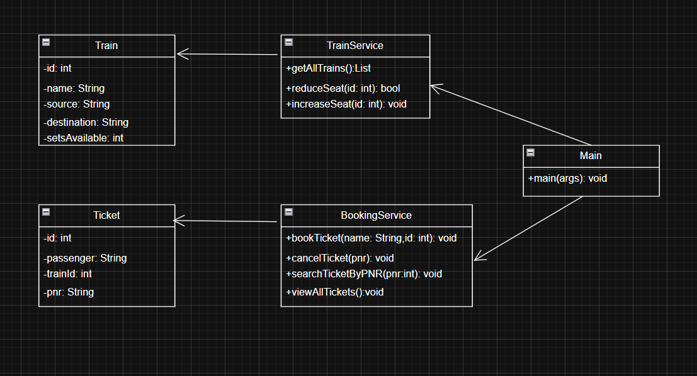

# 🚆 Train Ticket Booking System (Java + MySQL CLI App)

A simple Java-based command-line Train Ticket Booking System that demonstrates Object-Oriented Programming (OOP) and database interaction using JDBC and MySQL.

---

## ✅ Features

- View all available trains
- Book a ticket (with seat validation)
- Generate unique PNR
- View all booked tickets
- Search ticket by PNR
- Cancel ticket and update seat count
- Uses MySQL for persistent data storage

---

## 🛠️ Tech Stack

- Java (OOP Concepts)
- MySQL (Database)
- JDBC (Database Connectivity)
- IntelliJ IDEA (IDE)
- Terminal (Command-Line Interface)

---

## 📊 UML Diagram

This diagram represents the class-level design used in the project:



---

## 🧱 Project Structure
project-root/
│
├── model/
│ ├── Train.java
│ ├── Ticket.java
│
├── service/
│ ├── TrainService.java
│ ├── BookingService.java
│
├── util/
│ └── DBConnection.java
│
└── Main.java

---

## 🗃️ Database Schema (MySQL)

```sql
CREATE DATABASE train_booking;

USE train_booking;

CREATE TABLE trains (
    id INT PRIMARY KEY AUTO_INCREMENT,
    name VARCHAR(50),
    source VARCHAR(50),
    destination VARCHAR(50),
    seats_available INT
);

CREATE TABLE tickets (
    id INT PRIMARY KEY AUTO_INCREMENT,
    passenger_name VARCHAR(100),
    train_id INT,
    pnr VARCHAR(20),
    FOREIGN KEY (train_id) REFERENCES trains(id)
);


